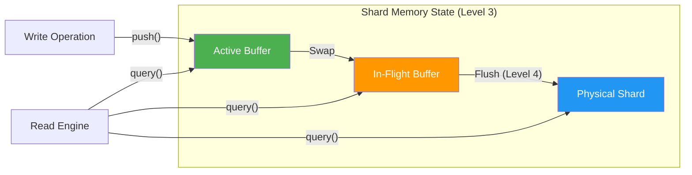
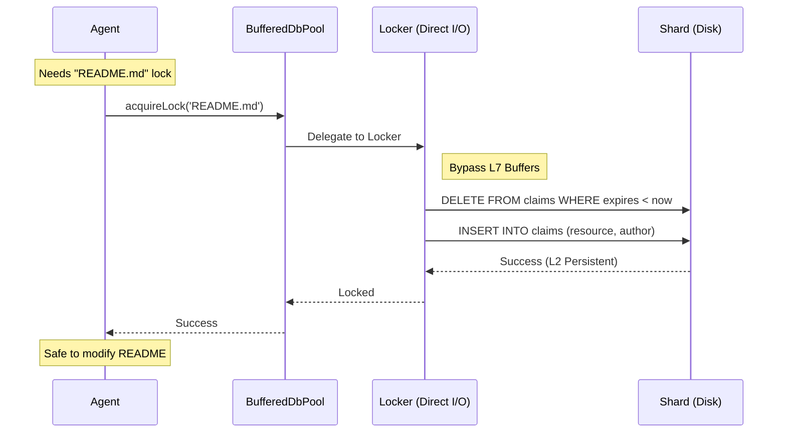

# Architecture Explained: How BroccoliQ Actually Works

This chapter peels back the curtain. No more "does it work" questions—this is how the Level 10 Sovereign Hive operates at scale.

---

## Chapter 1: Level 3 & 4 - The Dual Buffer Persistence Logic

### The Myth: "Does the queue use memory or disk?"

**Truth:** It uses **sharded dual-buffering** to orchestrate both.

The BroccoliQ Sovereign Hive is architected specifically for high-throughput sharded WAL journals. While it maintains Node.js compatibility, the system's modular `BufferedDbPool` is designed to leverage multiple independent SQLite files for 1,000,000+ operations per second.

### The "Dual Buffer" Pipeline (Level 3 & 4)


When you call `push(operation)`, the system injects the data into the **Active Buffer** of the target shard. This is a pure memory operation (0ms latency).

---

## Chapter 2: Level 2 & 5 - The Locking Bypass (Direct I/O)

### The Myth: "Is locking as fast as enqueuing?"

**Truth:** **No.** Locking requires **Direct Persistence (Level 2)** for absolute coordination.

Unlike enqueuing, which is buffered at Level 7 for eventual delivery, **Sovereign Locking** bypasses the buffers entirely. It uses direct database execution to ensure that every agent in the swarm has an immediate, authoritative view of resource ownership.

### Sequence: The Locking Bypass


---

## Chapter 3: Modular Persistence Architecture

To achieve **Level 10 Hardening**, the `BufferedDbPool` is divided into specialized domains:

| Component | Sovereignty Level | Responsibility |
|-----------|-------------------|----------------|
| **Locker.ts** | Level 5 (Global) | Cross-process mutual exclusion via Direct I/O. |
| **ShardState.ts** | Level 8 (Shards) | Life-cycle management of a single partition. |
| **Operations.ts** | Level 3 & 6 | "Builder's Punch" coalescing and RAW SQL execution. |
| **QueryEngine.ts** | Level 7 (Memory) | "Auth-Index" reactive querying and result merging. |

---

## Chapter 4: Level 7 - Reactive Indexing & Circular Buffers

### The Myth: "Does querying 'pending' hit the disk?"

**Truth:** **90% of the time, no.**

Each `ShardState` maintains a **Reactive Index** of active buffers. When a worker asks for pending jobs, the `QueryEngine` first scans the Level 7 indexes.

- **Auth-Index Optimization**: If a query filters by `status` (e.g. `pending`), the engine checks if that status index is "warmed." If so, it uses a **Map Lookup (O(1))** instead of a full buffer scan.
- **Circular Buffers**: `SqliteQueue` utilizes a massive in-memory circular buffer to avoid database polling entirely when the Hive is under heavy load.

---

## Chapter 5: Level 2 & 4 - Agent Shadow Isolation

Modern BroccoliQ uses **Agent Shadows** for explicit autonomy:

```typescript
// Explicit Sovereign Autonomy:
await dbPool.beginWork(agentId);

// All these operations land in the Agent's private Shadow Buffer
await dbPool.push({ type: 'insert', table: 'hive_knowledge', values: {...} }, agentId);
await dbPool.push({ type: 'update', table: 'hive_tasks', ... }, agentId);

// Atomic Commit: Move shadow contents to shard buffers
await dbPool.commitWork(agentId);
```

**Why Shadows Matter:**
- **Zero-Contention**: Agents work in private memory space. They only interact with the Hive during the `commitWork` phase.
- **Atomic Multi-file Operations**: Since the entire shadow is committed as one batch, cross-table integrity is guaranteed.

---

## Chapter 6: Level 10 - Axiomatic Type Sovereignty

The v2.1.0 update introduced **Unified Schema Sovereignty**. 

- **DatabaseSchema.ts**: The single source of truth for the entire Hive.
- **hive_** prefixing: All core system tables (knowledge, tasks, audit) are now standardized.
- **Hardened Type Safety**: Every query is type-checked at compile-time against the authoritative schema.

---

**Welcome to the Hive. Welcome to Level 10.**