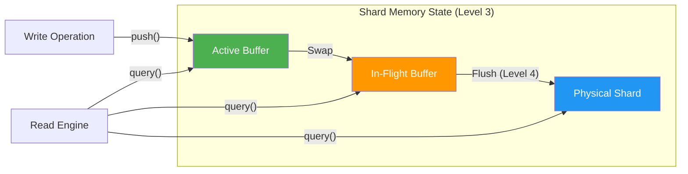
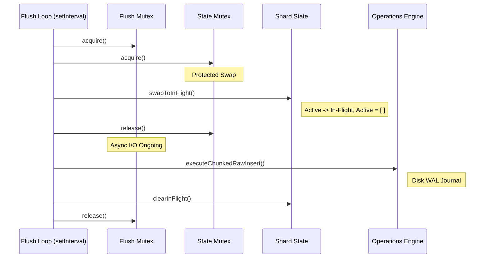
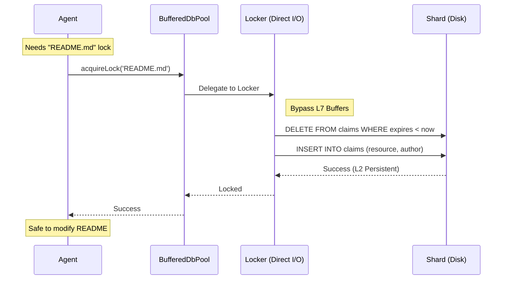
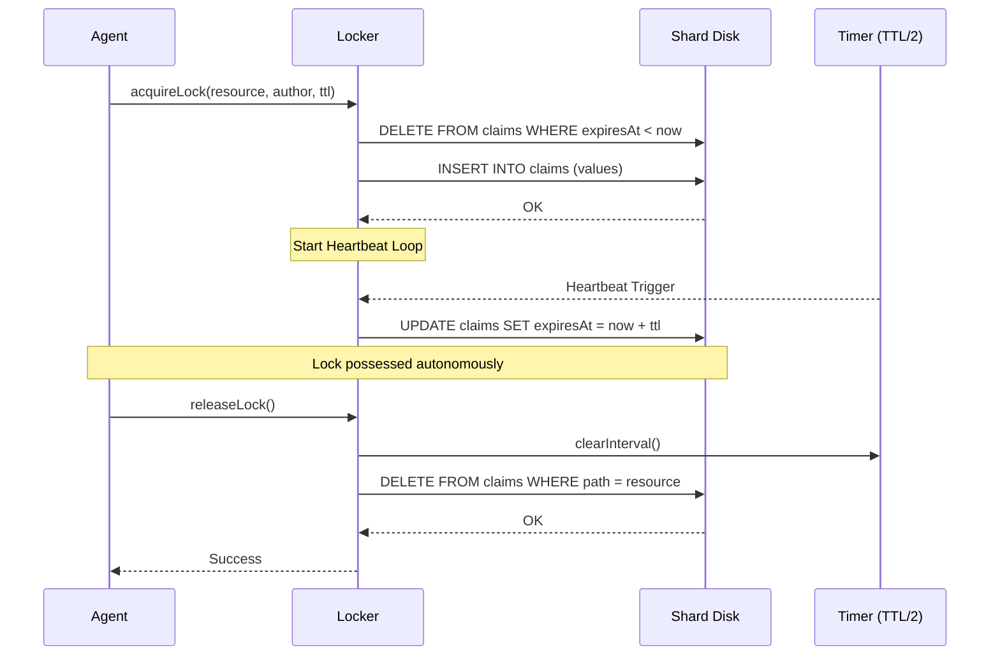
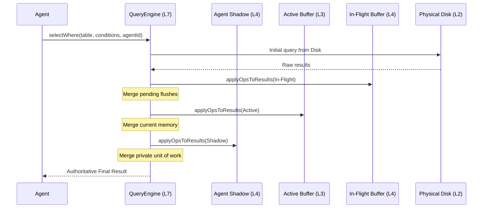
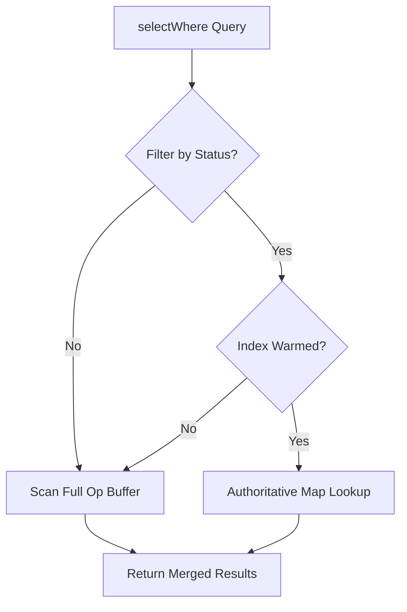
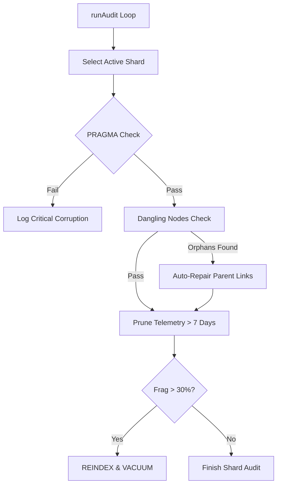
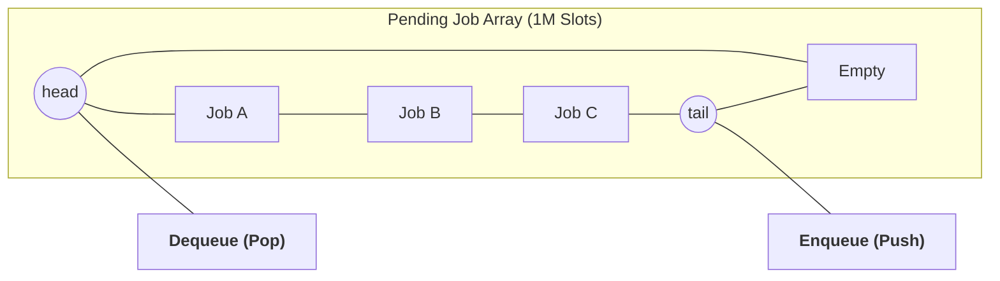
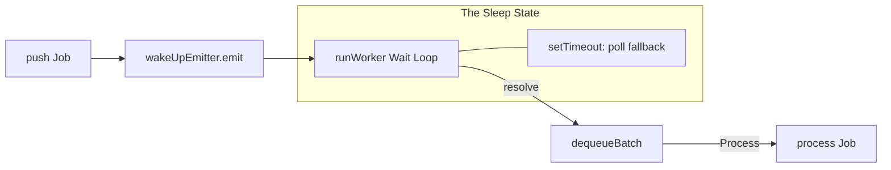
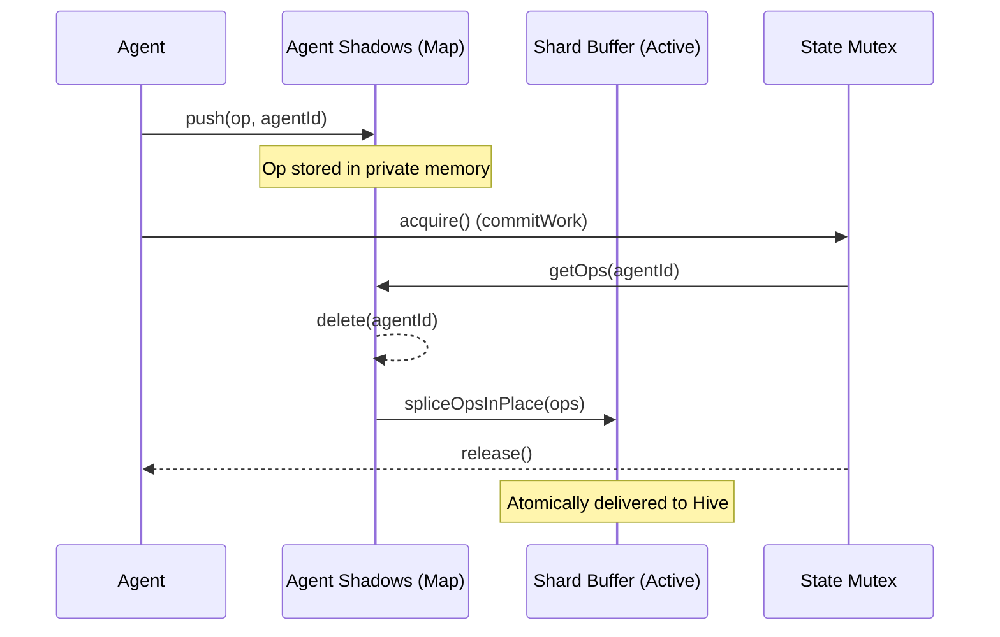

# Architecture Explained: How BroccoliQ Actually Works

This chapter peels back the curtain. No more "does it work" questions—this is how the Level 10 Sovereign Hive operates at scale.

---

## Chapter 1: Level 3 & 4 - The Dual Buffer Persistence Logic

### The Myth: "Does the queue use memory or disk?"

**Truth:** It uses **sharded dual-buffering** to orchestrate both.

The BroccoliQ Sovereign Hive is architected specifically for high-throughput sharded WAL journals. While it maintains Node.js compatibility, the system's modular `BufferedDbPool` is designed to leverage multiple independent SQLite files for 1,000,000+ operations per second.

### The "Dual Buffer" Pipeline (Level 3 & 4)

### The Flush Synchronization Lifecycle
To ensure zero-downtime, the `BufferedDbPool` uses two independent Mutexes to orchestrate the swap-and-flush cycle.

---

## Chapter 2: Level 2 & 5 - The Locking Bypass (Direct I/O)

### The Myth: "Is locking as fast as enqueuing?"

**Truth:** **No.** Locking requires **Direct Persistence (Level 2)** for absolute coordination.

Unlike enqueuing, which is buffered at Level 7 for eventual delivery, **Sovereign Locking** bypasses the buffers entirely. It uses direct database execution to ensure that every agent in the swarm has an immediate, authoritative view of resource ownership.

### Sequence: The Locking Bypass

---

## Chapter 3: Level 5 & 8 - The Locking Heartbeat Lifecycle

BroccoliDB uses **heartbeats** to maintain possession of a lock. This ensures that if an agent crashes, the lock is automatically released after the TTL expires.

### Sequence: Heartbeat & Expiration

---

## Chapter 4: Level 7 - The Triple-Buffer Query Merge

### The Myth: "How do we ensure Read-Your-Writes consistency?"

**Truth:** **The 4-Layer Recursive Merge.**

The `QueryEngine` provides absolute consistency by merging results from progressively more "recent" memory layers before returning them to the agent.

### Sequence: The Merge Priority

---

## Chapter 5: Level 7 - Auth-Index Decision Logic

### The Myth: "Does it always scan the buffer?"

**Truth:** **No.** If a table was "warmed," the engine skips the scan entirely for status-filtered queries.

The `QueryEngine` uses **authoritative indices** to provide O(1) status filtering. This logic branch determines whether we can bypass the high-cost buffer scan.

### Flow: Auth-Index Logic Branch

---

## Chapter 6: Level 9 - Autonomous Integrity Lifecycle 🛡️

### The Myth: "What happens if a shard corrupts?"

**Truth:** **The Hive heals itself.**

The `IntegrityWorker` is a background assistant that continuously audits every shard for physical and logical consistency.

### Logic: The Self-Healing Audit Loop

---

## Chapter 7: Level 7 - Pipelined Circular Buffers

### The Myth: "How does the memory buffer stay full?"

**Truth:** **Pipelined Dequeuing.**

`SqliteQueue` doesn't just fetch what you ask for. It proactively fetches **up to 2x the requested batch size** to pre-fill the local circular buffer.

### Visual: Circular Buffer Pointer Mechanics

---

## Chapter 8: Level 3 & 7 - The Wake-Up Pipeline

To avoid database polling (which kills performance), BroccoliQ uses an `EventEmitter` to wake up worker threads only when there is actually work to do.

### Flow: Wake-Up Signal Pipeline

---

## Chapter 9: Modular Persistence Architecture

To achieve **Level 10 Hardening**, the `BufferedDbPool` is divided into specialized domains:

| Component | Sovereignty Level | Responsibility |
|-----------|-------------------|----------------|
| **Locker.ts** | Level 5 (Global) | Cross-process mutual exclusion via Direct I/O. |
| **ShardState.ts** | Level 8 (Shards) | Life-cycle management of a single partition. |
| **Operations.ts** | Level 3 & 6 | "Builder's Punch" coalescing and RAW SQL execution. |
| **QueryEngine.ts** | Level 7 (Memory) | "Auth-Index" reactive querying and result merging. |

---

## Chapter 10: Level 2 & 4 - Agent Shadow Isolation

Modern BroccoliQ uses **Agent Shadows** for explicit autonomy. These shadows allow agents to perform multiple operations that are only visible to the rest of the Hive once they are **Committed**.

### Sequence: Atomic Shadow Commit

**Why Shadows Matter:**
- **Zero-Contention**: Agents work in private memory space. They only interact with the Hive during the `commitWork` phase.
- **Shadow Clean-up**: Any uncommitted shadow is automatically expired after 5 minutes by the `cleanupShadows` loop.

---

## Chapter 11: Level 10 - Axiomatic Type Sovereignty

The v2.1.0 update introduced **Unified Schema Sovereignty**. 

- **DatabaseSchema.ts**: The single source of truth for the entire Hive.
- **hive_** prefixing: All core system tables (knowledge, tasks, audit) are now standardized.
- **Hardened Type Safety**: Every query is type-checked at compile-time against the authoritative schema.

---

**Welcome to the Hive. Welcome to Level 10.**