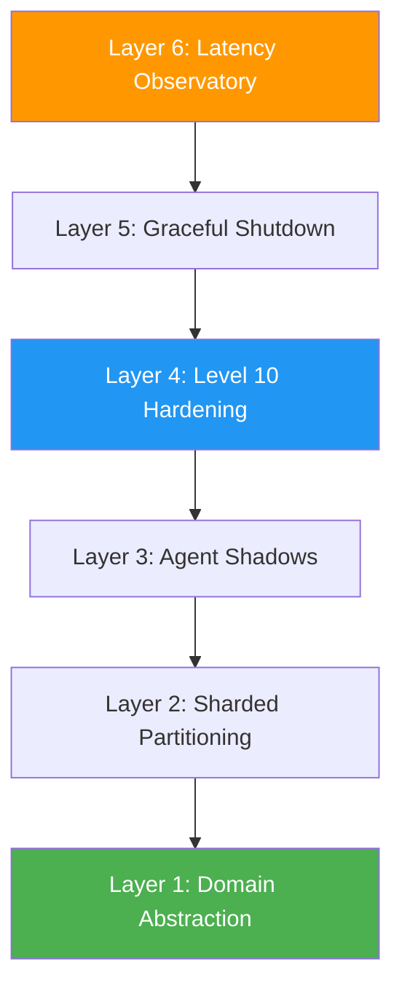
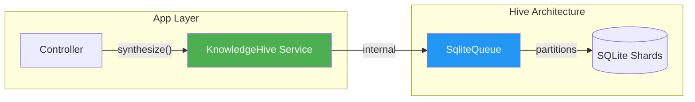

# Best Practices: Achieving Level 10 Sovereignty 🥦

This guide bridges the gap between "it works" and "Sovereign Architecture." These are the patterns used by teams running 1,000,000+ operations per second.

---

## 1. The Architecture Pyramid: 6 Layers of Hardening

### The Architecture Pyramid: 6 Layers of Hardened Sovereignty


Every production-grade Hive deployment must implement these six layers of defense and performance.

### Layer 1: Domain Abstractions
Never leak `SqliteQueue` or `BufferedDbPool` types into your business logic. Wrap the Hive in a Domain Service to maintain **Type Sovereignty**.

#### Domain Service Pattern


```typescript
// ✓ GOOD: Sovereign Domain Service
interface IKnowledgeHive {
  synthesize(thought: string): Promise<void>;
}

class KnowledgeHive implements IKnowledgeHive {
  private queue: SqliteQueue<Thought>;
  
  constructor() {
    this.queue = new SqliteQueue({ 
      shardId: 'knowledge-base',
      concurrency: 1000 
    });
  }
  
  async synthesize(thought: string) {
    // Domain logic and validation before enqueuing
    await this.queue.enqueue({ content: thought });
  }
}
```

### Layer 2: Sharded Partitioning (Level 8)
**Rule**: Partition by IO-Wall boundary.
If a specific domain (e.g., `telemetry`) generates > 50,000 ops/sec, give it a dedicated `shardId`. Sharding is your primary weapon against physical disk contention.

### Layer 3: Agent Shadow Isolation
**Rule**: Use `beginWork`/`commitWork` for atomic multi-step operations.
Avoid pushing individual unrelated operations to the pool. Group them into an **Agent Shadow** to ensure they land in the Hive's active buffers as a single, zero-contention unit.

### Layer 4: Level 10 Type Hardening
**Rule**: Eradicate `any`.
Utilize the strict Kysely types provided by the Hive. Ensure your job payloads are interfaces, not loose objects. This prevents "Schema Drift" from corrupting your WAL journals.

### Layer 5: Graceful Sovereign Shutdown
Never `kill -9` a Hive node. Use the built-in `flush()` and `stop()` mechanisms to ensure the **In-Flight Buffers** are safely persisted to their shards.

### Layer 6: The Latency Observatory
**Rule**: Monitor P99 Shard Latency.
A healthy Hive should have a P99 enqueue latency of < 1ms. If this spikes, increase your shard count (Level 8 horizontal scaling).

---

## 2. Anti-Patterns to Avoid

### ❌ The "Monolithic WAL" Trap
Putting 1M jobs from 100 different projects into a single shard.
**Cure**: Use `shardId` to distribute the IO load across multiple physical files.

### ❌ The "Opaque Transaction" Mistake
Using long-running database transactions instead of **Agent Shadows**.
**Cure**: Compute locally in a shadow, then `commitWork()` to the Hive's buffers in a micro-burst.

### ❌ Zero-Retry Complacency
Assuming the network or disk is siempre reliable.
**Cure**: Configure `visibilityTimeoutMs` and let the **Integrity Worker** reclaim jobs from crashed agents automatically.

---

## 3. Real-World Sovereignty Scenarios

### Case: The Analytics Tsunami
**Scenario**: Ingesting 100k events/sec.
**Solution**: Partition across 4 shards (`events-1` through `events-4`). Use **Quantum Boost** `enqueueBatch` for high-density delivery. 

### Case: The Self-Healing Swarm
**Scenario**: 1,000 workers on spot instances that crash frequently.
**Solution**: Use a conservative `visibilityTimeoutMs` (e.g., 2 minutes). The `IntegrityWorker` will perform a physical audit every 10 minutes and rescue orphaned jobs, ensuring zero data loss despite worker instability.

---
**Status**: `Sovereign Best Practices Hardened` | **Level**: `10` | **Philosophy**: `CPU-Velocity First`