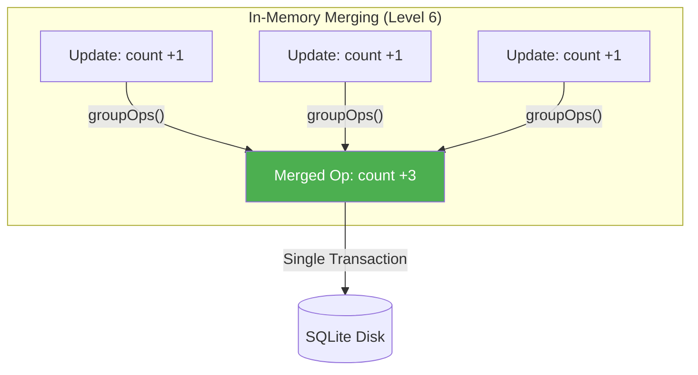
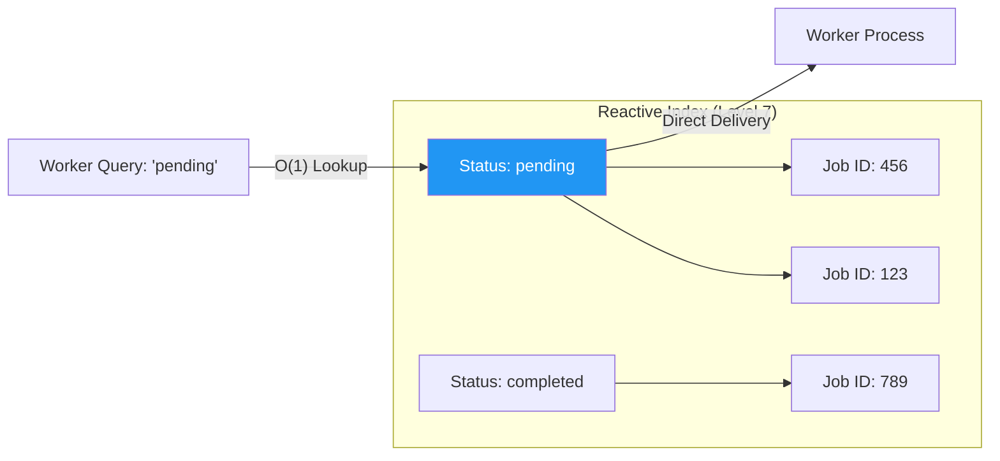

# How BroccoliQ Actually Works: The Sovereign Levels 🥦

This guide explains the mechanics of BroccoliQ in plain English. No technical jargon. Just how it works and why it matters, organized by the **10 Standardized Levels of Sovereignty**.

---

## Standardized Levels of Sovereignty

| Level | Name | Why It Matters | Real-World Analogy |
|-------|------|----------------|-------------------|
| **Level 1** | **Base Persistence** | Reliable SQLite/WAL disk storage | A handwritten ledger |
| **Level 2** | **Physical Sharding** | Avoiding filesystem lock contention | A library with 10 checkout desks |
| **Level 3** | **Dual-Buffering** | 0ms latency "Active/In-Flight" swap | Two baristas, no waiting line |
| **Level 4** | **Atomic Flush** | Ensuring data integrity during flush | A team synchronized to one clock |
| **Level 5** | **Sovereign Locking** | Multi-process/Global coordination | The Master Key system |
| **Level 6** | **Increment Merging** | Builder's Punch for high-speed counters | Counting by fives, not ones |
| **Level 7** | **Memory Indexing** | O(1) Reactive queries & Circular Buffers | Finding a book by index, not shelf-crawl |
| **Level 8** | **IO Bandwidth Scale** | Multiplying disk throughput via shards | Ten stadium doors instead of one |
| **Level 9** | **Autonomous Integrity** | Self-healing background worker | The Invisible Nightly Assistant |
| **Level 10** | **Type Sovereignty** | Axiomatic safety via Kysely & Unified Schema | A foolproof blueprint |

---

## Chapter 1: Level 1 & 2 - Base Persistence and Sharding

### The Problem: The Single Door
Imagine a massive stadium with 100,000 people, but only one entrance. No matter how fast people walk, the door is the limit.

### The Solution: The Ten-Door Stadium
BroccoliQ supports **Sharding**—splitting the database into multiple independent "doors."
1. **Partition:** Instead of one massive file, create 10 smaller ones.
2. **Route:** Give 10,000 people Ticket A (Shard A) and 10,000 people Ticket B (Shard B).
3. **Parallelism:** All 10 doors operate at the same time.

---

## Chapter 2: Level 3 & 4 - The Dual Buffer Pipeline

### The Problem: The Lonely Bookkeeper
Imagine a library where one person must check every book out and back in. Each book takes 2 seconds. 1,000 books = 33 minutes of waiting.

### The Solution: Two Bookkeepers (Dual Buffers)
BroccoliQ uses **dual buffers**—two buffers instead of one.
1. **Write Phase:** You send 1,000 operations to **Active Buffer** (0ms latency).
2. **Swap Phase:** After 10ms, swap **Active Buffer** ↔ **In-Flight Buffer**.
3. **Flush Phase:** **In-Flight Buffer** writes to disk in the background.
4. **Repeat:** While one flushes, the other handles new writes.

---

## Chapter 3: Level 5 - Sovereign Locking (Global Permission)

### The Problem: The Shared To-Do List
Imagine a team of 10 people in a kitchen. Two try to chop the same onion. Result: A mess and wasted effort.

### The Solution: The Master Key
BroccoliDB introduces **Sovereign Locking**—a global permission system that uses the database as the source of truth.
1. **Try to Claim:** Agent A asks: "Can I have the Master Key for 'chopping-onions'?"
2. **Atomic Write:** The system tries to write Agent A's name in the "Master Key" table.
3. **Winner Takes All:** If Agent A gets it, anyone else is told "Access Denied."
4. **Heartbeat:** Agent A periodically confirms "I'm still here!" to keep the lock.

---

## Chapter 4: Level 6 - Increment Merging (Builder's Punch)

### The Problem: The Counter Fight
You're counting apples. 1,000 people shouting "plus one!" results in 1,000 individual database updates.

### The Solution: Builder's Punch
BroccoliQ merges consecutive increments. Instead of 1,000 transactions for +1, it does **one transaction for +1000**.

### Visual: Operation Coalescing

---

## Chapter 5: Level 7 - Reactive Indexing & Circular Buffers

### The Problem: Scanning the Shelf
If you have 1,000,000 jobs, searching through them one by one to find "pending" ones is slow.

### The Solution: Memory-First Indexing
Each shard maintains a **Reactive Index** in RAM.
When a worker asks for jobs, the system looks at the RAM index first.

### Visual: The Auth-Index

---

## Chapter 6: Level 9 - Autonomous Integrity (Self-Healing)

### The Solution: The Invisible Assistant
BroccoliDB has an **Autonomous Integrity Worker**—a background assistant that never sleeps.
1. **Physical Audit:** Check every file for damage or corruption.
2. **Logical Repair:** Reclaim orphaned jobs from crashed agents.
3. **Space Management:** Automatically vacuum and reindex to maintain speed.

---

## Chapter 7: Level 10 - Axiomatic Type Sovereignty

### The Solution: The Foolproof Blueprint
v2.1.0 introduces **Unified Schema Sovereignty**.
1. **Unified Schema:** One master `Schema` interface in `DatabaseSchema.ts`.
2. **Hardened Types:** Every query is type-checked against the 16 `hive_` tables.
3. **Zero-Error Build:** Total parity between infrastructure and application.

---

## Next Steps

1. **USAGE.md** → Copy-paste patterns and API reference.
2. **COOKBOOK.md** → Practical recipes for real-world scenarios.
3. **ARCHITECTURE_EXPLAINED.md** → The deep technical math.

**BroccoliDB: Your infrastructure should be as smart as your agents.**
t as your agents.**