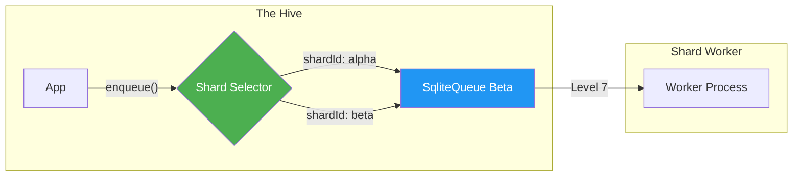
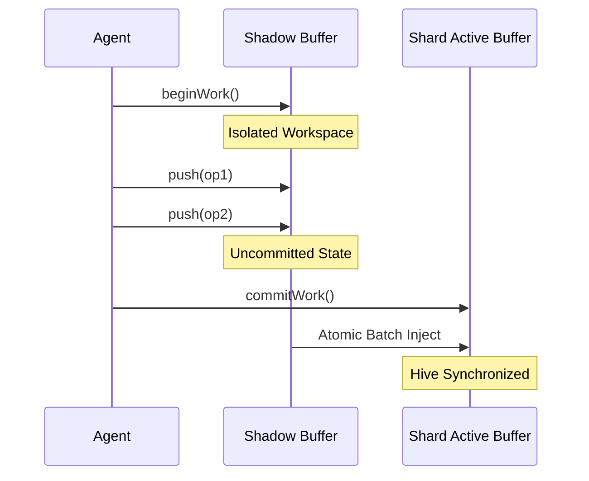
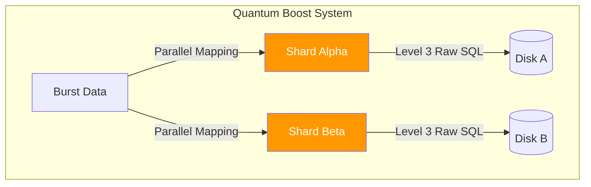

# Hybrid Queue: Implementation Cookbook (Modernized Level 10)

This cookbook provides **practical, copy-pasteable code recipes** for solving common problems with the BroccoliQ Hive. Each recipe is modernized for the **Zero-Shim, Sharded Architecture**.

---

## Recipe 1: Basic Sharded Job Queue

### Use Case
Enqueue items into partitioned shards and process them at scale.

#### Sharded Queue Flow


```typescript
// File: app/queues/sharded-email-queue.ts
import { SqliteQueue } from '../infrastructure/queue/SqliteQueue.js';

interface EmailJob {
  to: string;
  subject: string;
}

class EmailService {
  // Sharding by category for horizontal IO bandwidth
  private queue = new SqliteQueue<EmailJob>({ 
    shardId: 'transactional-emails', 
    concurrency: 500 
  });

  async sendEmail(to: string, subject: string) {
    // Direct push into the sovereign shard
    const jobId = await this.queue.enqueue({ to, subject }, {
      id: `email-${crypto.randomUUID()}`,
      priority: 10,
    });

    console.log(`[Hive] Job ${jobId} injected into 'transactional-emails' shard`);
    return jobId;
  }

  async startWorker() {
    this.queue.process(async (job) => {
      // Worker pulls from the shard's Level 7 Memory Index first
      console.log(`[Worker] Sending email to ${job.to}: ${job.subject}`);
      await actualSmtpSend(job);
    }, { 
      concurrency: 100,
      pollIntervalMs: 1 // High-frequency polling for Bun
    });
  }
}
```

---

## Recipe 2: Delayed Hive Operations

### Use Case
Schedule tasks to run at a specific future time.

```typescript
// File: app/schedulers/cleanup-scheduler.ts
import { SqliteQueue } from '../infrastructure/queue/SqliteQueue.js';

class MaintenanceHive {
  private queue = new SqliteQueue();

  async scheduleCleanup(resourceId: string, runAt: Date) {
    const delayMs = runAt.getTime() - Date.now();

    await this.queue.enqueue({ action: 'delete', resourceId }, {
      id: `cleanup-${resourceId}`,
      delayMs, // Shard will hold this in WAL until delay expires
    });
  }

  async startMaintenance() {
    this.queue.process(async (job) => {
      console.log(`[Hive] Executing delayed cleanup for ${job.resourceId}`);
      await deleteResource(job.resourceId);
    });
  }
}
```

---

## Recipe 3: Agent Shadow Atomic Operations

### Use Case
Perform multiple database operations as a single atomic unit without locking the Hive.

#### Agent Shadow Atomic Lifecycle


```typescript
// File: app/agents/knowledge-agent.ts
import { BufferedDbPool } from '../infrastructure/db/pool/index.js';

class KnowledgeAgent {
  constructor(private pool: BufferedDbPool) {}

  async processThought(agentId: string, thought: string, contextId: string) {
    // 1. Begin Sovereign Autonomy
    await this.pool.beginWork(agentId);

    try {
      // 2. Push operations into the Agent's Shadow Buffer
      await this.pool.push({
        table: 'knowledge',
        type: 'insert',
        values: { content: thought, context_id: contextId }
      }, agentId);

      await this.pool.push({
        table: 'agents',
        type: 'update',
        values: { last_active: Date.now() },
        where: { column: 'id', value: agentId }
      }, agentId);

      // 3. Atomic Commit: Flush shadow to Shard Buffers
      await this.pool.commitWork(agentId);
      console.log(`[Sovereign] Agent ${agentId} synthesized knowledge atomically.`);
    } catch (err) {
      console.error(`[Failure] Agent ${agentId} work aborted.`);
      // No rollback needed; shadow is just discarded if not committed.
    }
  }
}
```

---

## Recipe 4: Massive Throughput Burst (Quantum Boost)

### Use Case
Ingest over 100,000 operations per second using partitioned shards and Level 3 raw SQL.

#### Quantum Burst (Parallel Ingest)


```typescript
// File: app/ingest/telemetry-burst.ts
import { SqliteQueue } from '../infrastructure/queue/SqliteQueue.js';

class TelemetryHive {
  // Partition signals across multiple shards
  private shardA = new SqliteQueue({ shardId: 'signals-alpha' });
  private shardB = new SqliteQueue({ shardId: 'signals-beta' });

  async ingestBurst(signals: any[]) {
    // System automatically utilizes Level 3 "Quantum Boost" for chunked RAW SQL
    const promises = signals.map((sig, idx) => {
      const target = idx % 2 === 0 ? this.shardA : this.shardB;
      return target.enqueue(sig);
    });

    await Promise.all(promises);
    console.log(`[Burst] 100k signals partitioned and injected.`);
  }
}
```

---

## Recipe 5: Cross-Shard Integrity Monitoring

### Use Case
Perform physical audits across multiple sovereign shards.

```typescript
// File: app/monitor/integrity-monitor.ts
import { IntegrityWorker } from '../infrastructure/worker/IntegrityWorker.js';

async function auditHive() {
  const worker = new IntegrityWorker();
  
  // Audits all registered shards (main, signals-alpha, signals-beta, etc.)
  await worker.performPhysicalAudit();
  
  // Reclaims jobs from crashed agents across all shards
  await worker.reclaimStaleJobs();
  
  console.log(`[Integrity] Hive-wide physical audit complete.`);
}
```

---

## Recipe 6: Priority Handling with Sovereignty

### Use Case
Ensure critical system signals bypass normal queue processing.

```typescript
async function sendSystemSignal(type: 'CRITICAL' | 'NORMAL', data: any) {
  const queue = new SqliteQueue();
  
  // High priority number floats to the top of the Level 7 Memory Index
  await queue.enqueue(data, {
    priority: type === 'CRITICAL' ? 1000 : 10,
    id: `signal-${crypto.randomUUID()}`
  });
}
```

---

## 👨‍🍳 Advanced Ingredients
Refer to [HIBRID_QUEUE_DEEP_DIVE.md](HIBRID_QUEUE_DEEP_DIVE.md) for Level 10 internal details on **Zero-Allocation Parameter Buffering** and **O(1) Status Filtering**.