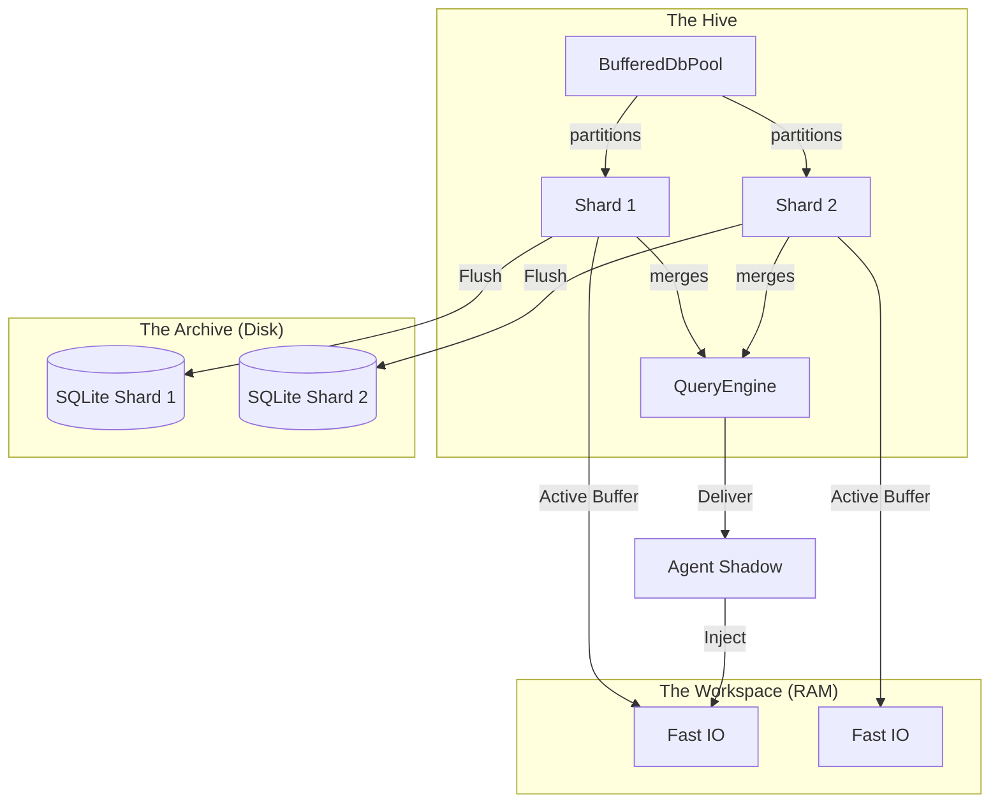
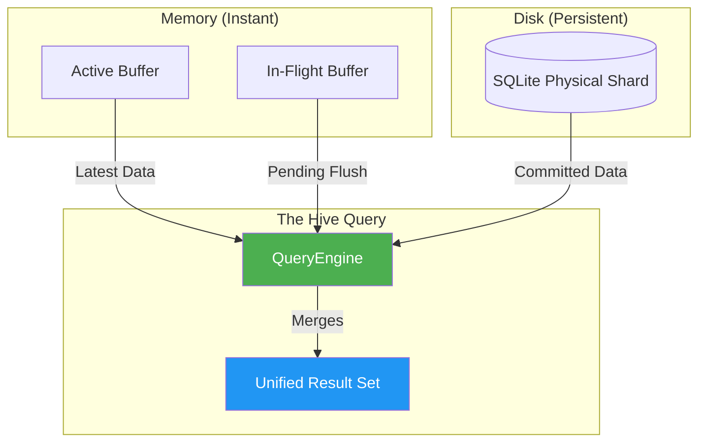

# Hybrid Queue: The Level 10 Deep Dive 🌳

This document explores the **Sovereign Hive Architecture** at 10 levels of depth. It covers sharded dual-buffering, memory-first dispatch, atomic agent coordination, and the zero-allocation optimization pipeline.

---

## Level 0: The Big Picture (In Plain English)

Before diving into the optimization levels, it is essential to understand the core philosophy of the Hive: **Memory is the Workspace; Disk is the Archive.**

Most databases treat every write as a high-stakes, disk-locked event. BroccoliQ treats every write as an **Instant Memory Injection**. 

### The Sovereign Architecture at a Glance


> [!TIP]
> **Why this matters**: By partitioning across shards and prioritizing memory buffers, we eliminate the "Single-File IO Wall." Your agents never wait for a disk lock; they only wait for the speed of light (or at least, your RAM).

---

## Level 1: Infinite Horizon Flush Cycles (The Swap)

### The Philosophy
Traditional databases say: "The disk is slow. Write less often."
**BroccoliQ says:** "The disk is the bottleneck. Write independently."

The core mechanics of the `BufferedDbPool` (modularized in `/infrastructure/db/pool/`) rely on **Sharded Dual-Buffering**. Each sovereign shard maintains two independent memory buffers:

```typescript
class ShardState {
  private activeBuffer: WriteOp[] = [];
  private inFlightBuffer: WriteOp[] = [];
  
  // High-Throughput: Infinite Push (0ms latency)
  push(op) { this.activeBuffer.push(op); }

  // Atomic Swap & Synchronize
  async flush() {
    if (this.activeBuffer.length === 0) return;
    
    // Swap pointers: The Infinite Horizon
    this.inFlightBuffer = this.activeBuffer;
    this.activeBuffer = []; // Reset for incoming writes
    
    // Flush the old buffer to physical WAL while writes continue
    await this.engine.flushToDisk(this.inFlightBuffer);
  }
}
```

**The Gain:** Zero-copy, zero-blocking writes. Database synchronization becomes a background background heartrate, not a foreground blocker.

---

## Level 2: Sovereign Sharding (Horizontal Bandwidth)

Sharding is no longer a wrapper; it is the **backbone**. By partitioning the `BufferedDbPool` across multiple physical SQLite WAL journals, we bypass the filesystem’s single-file lock wall.

- **Level 8 Sovereignty**: 10 shards = 10 physical I/O paths. Total Hive throughput = Sum(Shard Throughput).
- **Physical Isolation**: A burst of telemetry in the `signals` shard cannot block critical commands in the `main` shard.

---

## Level 3: Agent Shadows (Explicit Transactional Autonomy)

We purged the legacy "Transaction" shims. Modern BroccoliQ uses **Agent Shadows** for explicit, isolated workspace control.

```typescript
// Level 3 Independence:
class AgentShadow {
  private shadowBuffer: WriteOp[] = [];
  
  // Begin isolated work unit
  beginWork(agentId) { /* Init shadow buffer */ }
  
  // Collect uncommitted modifications
  push(op) { this.shadowBuffer.push(op); }
  
  // Atomic Commit: Move into the Shard's Active Buffer
  async commitWork() {
    for (const op of this.shadowBuffer) {
      shard.push(op); 
    }
    this.shadowBuffer = [];
  }
}
```

### The "Zero-Contention" Advantage
Shadows allow 1,000+ agents to compute and modified state in parallel without ever acquiring a database lock until the final micro-second of the `commitWork` phase.

---

## Level 4: Level 7 Reactive Indexing

Status filtering (e.g., `status = 'pending'`) is often the slowest part of a queue. BroccoliQ maintains a reactive, in-memory status index for every shard.

- **O(1) Dispatching**: Workers query the memory index first.
- **Merge-Query Intelligence**: The `QueryEngine` merges the on-disk database state with the in-memory `ActiveBuffer` and `In-FlightBuffer` in real-time, providing total visibility without the disk latency.

### The QueryEngine Bridge (Level 7)


---

## Level 5: Runtime-Agnostic Engine Intelligence

BroccoliQ detects its host environment to select the most efficient database engine:
- **Bun Engine**: Leverages `bun:sqlite` for raw direct-memory access.
- **Node Engine**: Defaults to `better-sqlite3` for production-grade reliability.

The **Sovereign Dialect Layer** ensures high-level Kysely queries remain identical across both runtimes.

---

## Level 6: Quantum Boost (Chunked Raw SQL)

For massive bursts (> 100 operations), the pool activates **Quantum Boost (Level 3)**. Instead of iterative ORM calls, it generates a single, massive Raw SQL `INSERT` or `UPDATE` statement using a pre-allocated parameter buffer.

---

## Level 10: Type Sovereignty & Professional Hardening

We have achieved **Total Type Safety** across the Hive. The modular architecture is strictly typed with **zero `any` usage** in the core data path.

- **Kysely Integration**: Full relational integrity and autocompletion for schema-bound operations.
- **Modular Encapsulation**: Component boundaries (`ShardState`, `Operations`, `QueryEngine`, `Locker`) are strictly defined to prevent domain leakage.

**Welcome to the Sovereign Hive. This is Infrastructure at Level 10.**