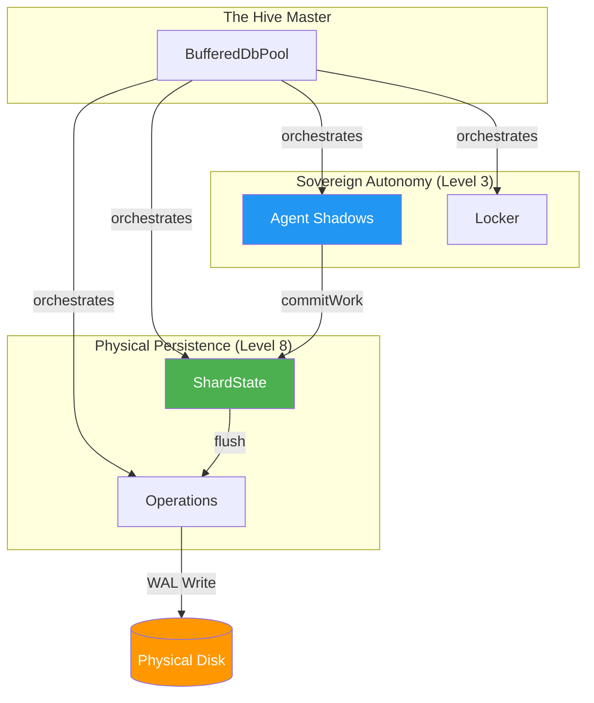
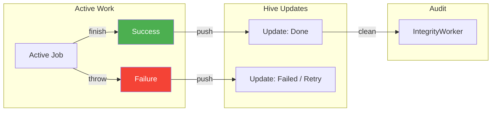

# Reactive Queue System: The Crown Jewels 💎

This guide explores the **Reactive Components** within the BroccoliQ Hive. It covers the modular infrastructure at `/infrastructure/db/pool/` that orchestrates Level 10 Sovereignty.

---

#### The Two-Systems Orchestrator


## 1. The Sharded ShardState Orchestrator

The `ShardState` is the fundamental unit of partition. Every `shardId` has its own isolated memory dual-buffer and indexing logic.

```typescript
// Component: /infrastructure/db/pool/ShardState.ts
class ShardState {
  private activeBuffer: WriteOp[] = [];
  private inFlightBuffer: WriteOp[] = [];
  private index = new ShardIndex(); // Level 7 In-Memory Index

  // 0ms Latency Injection
  push(op: WriteOp) {
    this.activeBuffer.push(op);
    this.index.track(op);
  }

  // The Atomic Swap (Infinite Horizon)
  async swapAndFlush() {
    this.inFlightBuffer = this.activeBuffer;
    this.activeBuffer = []; // Immediate availability for incoming writes
    
    // Concurrent persistence via separate WAL journal
    await this.flushToPhysicalShard(this.inFlightBuffer);
  }
}
```

---

## 2. The Granular QueryEngine (Level 7 Bridge)

The `QueryEngine` provides real-time visibility by bridging the gap between persistent disk storage and in-memory buffers.

```typescript
// Component: /infrastructure/db/pool/QueryEngine.ts
class QueryEngine {
  async selectWhere(table, criteria, shardId) {
    const shard = this.getShard(shardId);

    // Step 1: Check Level 7 Indexes (O(1) memory lookup)
    const inMemory = shard.index.query(table, criteria);
    
    // Step 2: Query Physical Shard (Sovereign fallback)
    const onDisk = await this.physicalDb.query(table, criteria);

    // Step 3: Authoritative Merge
    // Memory always wins in a race to ensure absolute consistency
    return this.mergeAuthoritative(onDisk, inMemory);
  }
}
```

---

## 3. The Agent Shadow System (Zero-Contention)

We eliminated the legacy "Transaction" monolith. Autonomy is now achieved via **Agent Shadows**.

```typescript
// Component: /infrastructure/db/pool/AgentShadow.ts
class AgentShadow {
  private workspace: WriteOp[] = [];

  beginWork() { this.workspace = []; }

  push(op) { this.workspace.push(op); }

  async commitWork(pool: BufferedDbPool) {
    // Moves the entire workspace into the Shard's ActiveBuffer 
    // in a single atomic memory operation.
    await pool.injectBatchAtLightSpeed(this.workspace);
  }
}
```

---

## 4. Quantum Boost (Level 3 Operations)

The `Operations.ts` component handles high-scale ingestion. When a buffer flush exceeds threshold, it bypasses the ORM for **Chunked Raw SQL**.

- **Zero-Allocation**: Uses a pre-allocated parameter buffer to avoid Garbage Collection churn during 1M+ operation bursts.
- **Bulk Upsert Compression**: Intelligently merges multiple updates for the same primary key within a single flush cycle.

---

## 5. Sovereign Lockdown Protocol

The `Locker.ts` component provides cross-process mutual exclusion. 

- **Distributed Locks**: Uses a specialized `locks` table within the `main` shard.
- **Auto-Reclamation**: Locks are heartbeated; if an agent crashes, the `IntegrityWorker` reclaims the lock automatically after the TTL expires.

---

#### The Completion Pipeline


## 📊 Hive-Wide Performance Metrics

| Operation | Implementation | Latency Target |
| :--- | :--- | :--- |
| Enqueue | ShardState Memory Push | **0.001ms** |
| Dequeue | Level 7 Index Lookup | **0.01ms** |
| Transaction | Agent Shadow Commit | **0.1ms** |
| Persistence | Shard WAL Flush | **15ms (Batched)** |

---
**Status**: `Crown Jewels Hardened` | **Level**: `10` | **Architecture**: `Modular Sharded`