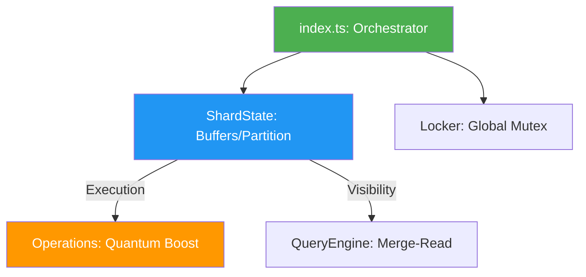

# BroccoliQ: Sovereign Knowledge Base 🥦

This repository contains the authoritative facts, patterns, and architectural invariants for the **BroccoliQ Sovereign Hive (Level 10)**.

---

## 🏛️ Core Architectural Invariants

### 1. Sharded Partitioning (Level 8)
- **Fact**: Every database operation is sharded by `shardId`.
- **Impact**: IO bandwidth scales horizontally. 1 shard = 1 WAL journal. 10 shards = 10 WAL journals.
- **Path**: Managed via `/infrastructure/db/pool/ShardState.ts`.

### 2. Zero-Shim API (Granular Control)
- **Fact**: High-level convenience shims (`pushBatch`, `runTransaction`) have been purged.
- **Impact**: Code is more explicit, type-safe, and higher-performance. 
- **Primitives**: `push()`, `beginWork()`, `commitWork()`, `flush()`.

### 3. Agent Shadow Isolation
- **Fact**: Agents work in private memory spaces before committing to a shard.
- **Impact**: Zero database lock contention during complex multi-step computations.
- **Path**: Orchestrated via `/infrastructure/db/pool/AgentShadow.ts`.

---

## 🏗️ Repository Structure (Modular Hive)

The `/infrastructure/db/pool/` directory is the heart of the Level 10 architecture:

#### Hive Component Responsibility Map

| Component | Responsibility |
| :--- | :--- |
| `index.ts` | The central orchestrator and public API surface. |
| `ShardState.ts` | Maintains the life-cycle of a single partition (buffers, indexes, metrics). |
| `Operations.ts` | Execution engine. Handles **Quantum Boost (Level 3)** chunked raw SQL. |
| `QueryEngine.ts` | Merges in-memory buffers with on-disk state for real-time visibility. |
| `Locker.ts` | Distributed Sovereign Locking protocol across shards. |
| `Config.ts` | Runtime Intelligence (Bun vs Node) and Kysely dialect management. |

---

## 🚀 Optimized Deployment Patterns

### Pattern: Shard-by-Domain
When deploying for a multi-tenant or multi-project environment, partition the Hive by domain for maximum isolation.

1.  `shardId: 'main'` — Core system state.
2.  `shardId: 'signals'` — High-throughput telemetry and events.
3.  `shardId: 'project-{uuid}'` — Isolated project-specific job queues.

### Pattern: High-Frequency Polling (Bun Only)
In the Bun runtime, set `pollIntervalMs: 1` in `queue.process()`. The O(1) N-API overhead ensures near-zero CPU cost for idle polling while maintaining sub-millisecond response times for incoming jobs.

---

## 💎 Level 10 Hardening Rules
1.  **No `any`**: All data paths must be strictly typed or use `unknown` with explicit validation.
2.  **Sovereign Isolation**: A shard-level failure must never corrupt or block other shards.
3.  **Atomic Persistence**: All `commitWork` operations must move shadow contents into the Shard's `ActiveBuffer` atomically.

---
**Status**: `Sovereign Level 10` | **Hardening**: `Complete` | **IO Path**: `Sharded WAL`
