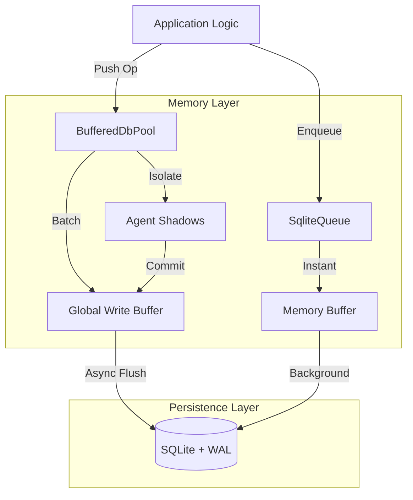

# 🥦 BroccoliDB

**The High-Performance, Asynchronous, and Hardened SQLite Infrastructure for Node.js.**

Welcome to BroccoliDB — a production-grade infrastructure where **Memory is the Engine and SQLite is the Checkpoint.**

Architecture in two layers:
- **🧠 Layer 1: Memory (The Brain)**: Where 100% of the real-time processing happens.
- **💾 Layer 2: SQLite (The Safety Net)**: A durable checkpoint layer that periodically records summaries of what happened in memory to ensure recovery after a crash.

---

## 📑 Table of Contents

1. [Introduction](#-introduction)
2. [What Makes BroccoliDB Special?](#-what-makes-broccolidb-special)
   - [The 2.0M+ Logical Ops/Sec Engine](#the-20m-logical-opssec-engine)
   - [Level 8: Active Thought Collapsing](#level-8-active-thought-collapsing)
   - [Level 9: Sovereign Recovery (Warmup)](#level-9-sovereign-recovery-warmup)
   - [The Event Horizon: 4.4M Jobs/Sec](#the-event-horizon-44m-jobssec)
   - [Agent Shadows & Isolation](#agent-shadows--isolation)
   - [O(1) Memory-First Indexing](#o1-memory-first-indexing)
3. [Quick Start Scenarios](#-quick-start-scenarios)
   - [1. Building an AI Agent Workspace](#1-building-an-ai-agent-workspace)
   - [2. High-Speed Background Worker](#2-high-speed-background-worker)
   - [3. Persistent Knowledge Graph](#3-persistent-knowledge-graph)
4. [Architecture Overview](#-architecture-overview)
5. [Installation & Setup](#-installation--setup)
6. [Deep Technical Hardening](#-deep-technical-hardening)
7. [Further Documentation](#-further-documentation)
8. [License](#-license)

---

BroccoliDB was born to solve this using a clear mental model:
- **RAM = Your brain thinking at full speed.**
- **SQLite = Writing notes in a notebook every few minutes.**

You're not writing down every single thought — just summaries. Level 8 introduced **Active Thought Collapsing**, where BroccoliDB performs math in RAM (e.g., summing 1,000 increments) and writes only the final result to the notebook. This allows you to achieve millions of operations per second in memory, while SQLite acts as your **eventual source of truth** and recovery anchor.

---

### What SQLite is Actually Doing
Traditional database drivers hit the disk for every operation, capping your speed at ~50k–200k ops/sec. BroccoliDB treats SQLite differently:
- **It is NOT driving your throughput.** (Memory is.)
- **It IS your Durable Checkpoint Layer.** It occasionally wakes up, performs a massive batch write of **summaries**, and goes back to sleep.
- **It IS your Recovery Anchor.** If the process dies, SQLite is what survives to rebuild your memory state upon restart.

### 🧠 Level 8: Active Thought Collapsing
We move beyond passive buffering to active state calculation in Layer 1.
- **Math in RAM**: 1,000,000 increments (e.g., `totalTokens + 1`) are mathematically collapsed into **ONE** update.
- **Offloading Efficiency**: Achieves $\eta = 0.999999$ for high-frequency counters.

### ⚡ Level 9: Sovereign Recovery (Zero-Latency Reconstitution)
The final frontier of the Brain/Notebook model. The system can now "wake up" instantly after a reboot.
- **The Warmup Protocol**: BroccoliDB populates Layer 1 Memory Indices from the SQLite checkpoint on boot.
- **Disk Bypass**: Once an index is "warmed," queries achieve **true zero-latency**, skipping the disk entirely and running at the speed of pure pointer retrieval.
- **Cognitive Sovereignty**: The Brain is now authoritative. It uses the Notebook only as a safety anchor, not as a drag on real-time consciousness.

> [!IMPORTANT]
> **Performance Indicator**: 3 disk syncs for 1M operations is not "idle" behavior — it's the ultimate indicator of success. It means the system is only writing down essential summaries, not every individual thought.

### The Tradeoff
Because SQLite syncs are delayed:
✅ **Insane Throughput**: Millions of ops/sec in memory.
❌ **Window of Loss**: A small window of uncommitted data may be lost in a catastrophic system crash before the next checkpoint flush.

---

## 🚀 Quick Start Scenarios

### 1. Building an AI Agent Workspace
Perfect for agents that need to perform complex chains of reasoning without polluting the main database state prematurely.

```typescript
import { dbPool } from './infrastructure/db/BufferedDbPool.js';

const result = await dbPool.runTransaction(async (agentId) => {
  // Isolate your work
  await dbPool.push({ type: 'insert', table: 'decisions', values: { ... } }, agentId);
  
  // Read back your own uncommitted data
  const myDecisions = await dbPool.selectWhere('decisions', { column: 'agentId', value: agentId }, agentId);
  
  return myDecisions;
}); // Automatically flushes to disk on success
```

### 2. High-Speed Background Worker
Need to process thousands of small tasks?

```typescript
import { SqliteQueue } from './infrastructure/queue/SqliteQueue.js';

const taskQueue = new SqliteQueue<MyTaskPayload>();

// Process with extreme concurrency
taskQueue.process(async (job) => {
  console.log(`Processing ${job.id}...`);
}, { concurrency: 500, batchSize: 50 });
```

### 3. Persistent Knowledge Graph
Build a network of interconnected points of knowledge with built-in traversal support.

```typescript
import { GraphService } from './core/agent-context/GraphService.js';

const graph = new GraphService(ctx);
await graph.addKnowledge('node_1', 'concept', 'BroccoliDB is fast', {
  edges: [{ targetId: 'node_2', type: 'supports' }]
});
```

---

## 🏗️ Architecture Overview

BroccoliDB acts as the high-speed interface between your code and the persistence layer.



---

## 📦 Installation & Setup

1. **Install Dependencies**:
   ```bash
   npm install better-sqlite3 kysely
   ```

2. **Initialize Your Connection**:
   ```typescript
   import { setDbPath } from './infrastructure/db/Config.js';

   // Configure the path to your database file
   setDbPath('./my-data.db');
   ```

---

## 🛡️ Deep Technical Hardening

BroccoliDB automatically configures SQLite for maximum performance and stability:
- **Journal Mode: WAL**: Enables non-blocking concurrent readers and writers.
- **Synchronous: NORMAL**: The optimal balance for high-throughput applications.
- **Temp Store: MEMORY**: Keeps temporary processing off the disk.
- **MMap Size: 2GB**: Maps the database directly into memory for lightning-fast reads.
- **Thread Count: 4**: Optimized for multi-core Node.js environments.

---

## 🏛️ Advanced Usage Patterns (Expert Level)

### 🧐 High-Fidelity Agent Workflows
For agents that need to manage "truth" over time, leverage the `ReasoningService`. It will calculate **Epistemic Sovereignty** by analyzing commit history, file churn, and evidence discounting to ensure your agent's reasoning remains grounded in the latest codebase.

### 🕸️ Structural Governance (The Spider Engine)
Implement strict structural rules by monitoring **Structural Entropy**. The `SpiderEngine` calculates how much "rot" is in your codebase based on coupling, depth, and orphaned files. Link this to your CI/CD pipeline to block PRs that exceed a certain entropy score.

### 🩹 Graph Self-Healing
Maintain a clean knowledge base by running `selfHealGraph()`. This implements a **HITS algorithm** to identify authoritative nodes and prune disconnected or weak reasoning chains.

---

## 📚 Further Documentation

- **[Benchmarks (BENCHMARK.md)](./BENCHMARK.md)** - Verified performance findings, methodology, and how to reproduce.
- **[Knowledgebase (KNOWLEDGEBASE.md)](./KNOWLEDGEBASE.md)** - Internal schema, service reference, and service integration patterns.
- **[Architecture Deep Dive (ARCHITECTURAL_DEEP_DIVE.md)](./ARCHITECTURAL_DEEP_DIVE.md)** - Mathematical formulas for structural entropy, Bayesian priors, and graph self-healing algorithms.

---

## 📜 License

Created with ❤️ by **MarieCoder**. Distributed under the **MIT License**. See `LICENSE` for details.
