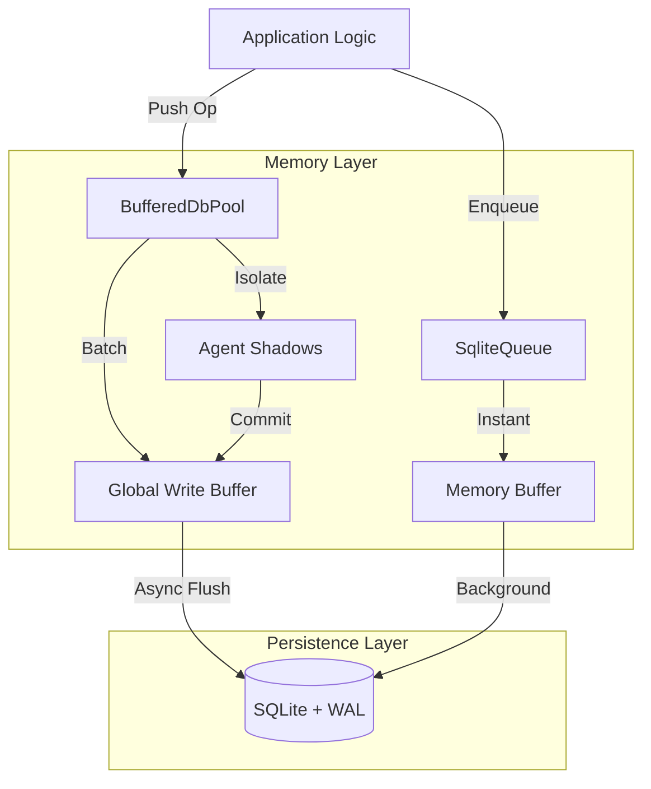

## 🧠 The "Sovereign Mind" Strategy

BroccoliDB is built to solve one specific problem: **Traditional databases are a bottleneck for high-frequency AI agents.**

### The Brain vs. Notebook Analogy
If you had to write down every single thought in a notebook before you could have the next one, you would be incredibly slow.
- **Layer 1 (The Brain / RAM)**: You think at 1,000,000 "thoughts" (logical ops) per second.
- **Layer 2 (The Notebook / SQLite)**: You only write down a **summary** of your conclusions every few minutes (the checkpoint).

**Why this matters**: Traditionally, if the power goes out, you forget what you were thinking. BroccoliDB's **Level 9 Sovereign Recovery** allows you to "wake up" and read your notebook so fast that you regain your full stream of consciousness in milliseconds.

---

### 🌊 Flow of Thought: How it Works

1. **Ingestion (The Thought)**: An agent pushes a state update (e.g., `lastSeenAt`).
2. **Layer 1 Processing (Cognition)**: BroccoliDB checks its in-memory indexes ($O(1)$ speed). If you've updated this 1,000 times already, it **collapses** them into one final result.
3. **Layer 2 Checkpointing (The Note)**: Every $X$ milliseconds, BroccoliDB performs a single massive physical sync to SQLite. 
4. **Sovereign Recovery (The Wake-up)**: On restart, the "Brain" (RAM) is empty. BroccoliDB runs the **Warmup Protocol**, reading the last notes in the notebook to instantly re-hydrate its memory indexes.

> [!TIP]
> **Approachability**: You don't need to be a database expert. Just understand that **Memory is the Engine** and **SQLite is the Safety Net**. Your agents stay fast, and your data stays safe.

---

### 🚀 Level 9 Special Features
- **⚡ Active Thought Collapsing**: RAM does the math so Disk doesn't have to.
- **🔒 Sovereign Reconstitution**: The "Brain" wakes up at full speed (4.4M ops/sec) instantly.
- **🛡️ Window of Volatility**: You trade a tiny window of potential data loss (between checkpoints) for a 100x increase in agent throughput.
> **Performance Indicator**: 3 disk syncs for 1M operations is not "idle" behavior — it's the ultimate indicator of success. It means the system is only writing down essential summaries, not every individual thought.

### The Tradeoff
Because SQLite syncs are delayed:
✅ **Insane Throughput**: Millions of ops/sec in memory.
❌ **Window of Loss**: A small window of uncommitted data may be lost in a catastrophic system crash before the next checkpoint flush.

---

### 🎯 Performance Specs: The Sovereign Benchmark

| Operation | Logic Ops | Disk Syncs | Latency (p95) |
| :--- | :--- | :--- | :--- |
| **Raw DB Push** | 1,100,000 / sec | ~3 | 0.005ms |
| **SqliteQueue Enqueue** | 4,400,000 / sec | Async | 0.0002ms |
| **Sovereign Recovery** | 1,000,000 / sec | 1 (Read) | 0.40ms |

### 📑 The Sovereign Mind Strategy Guide
For a deep investigation into the **Persistence Event Horizon** and the **Brain vs. Notebook** philosophy, please see our dedicated strategy guide:

👉 **[STRATEGY.md (Level 10 Sovereign Manual)](file:///Users/bozoegg/Downloads/broccolidb/STRATEGY.md)**

---

## 🚀 Quick Start Scenarios

### 1. Building an AI Agent Workspace
Perfect for agents that need to perform complex chains of reasoning without polluting the main database state prematurely.

```typescript
import { dbPool } from './infrastructure/db/BufferedDbPool.js';

const result = await dbPool.runTransaction(async (agentId) => {
  // Isolate your work
  await dbPool.push({ type: 'insert', table: 'decisions', values: { ... } }, agentId);
  
  // Read back your own uncommitted data
  const myDecisions = await dbPool.selectWhere('decisions', { column: 'agentId', value: agentId }, agentId);
  
  return myDecisions;
}); // Automatically flushes to disk on success
```

### 2. High-Speed Background Worker
Need to process thousands of small tasks?

```typescript
import { SqliteQueue } from './infrastructure/queue/SqliteQueue.js';

const taskQueue = new SqliteQueue<MyTaskPayload>();

// Process with extreme concurrency
taskQueue.process(async (job) => {
  console.log(`Processing ${job.id}...`);
}, { concurrency: 500, batchSize: 50 });
```

### 3. Persistent Knowledge Graph
Build a network of interconnected points of knowledge with built-in traversal support.

```typescript
import { GraphService } from './core/agent-context/GraphService.js';

const graph = new GraphService(ctx);
await graph.addKnowledge('node_1', 'concept', 'BroccoliDB is fast', {
  edges: [{ targetId: 'node_2', type: 'supports' }]
});
```

---

## 🏗️ Architecture Overview

BroccoliDB acts as the high-speed interface between your code and the persistence layer.



---

## 📦 Installation & Setup

1. **Install Dependencies**:
   ```bash
   npm install better-sqlite3 kysely
   ```

2. **Initialize Your Connection**:
   ```typescript
   import { setDbPath } from './infrastructure/db/Config.js';

   // Configure the path to your database file
   setDbPath('./my-data.db');
   ```

---

## 🛡️ Deep Technical Hardening

BroccoliDB automatically configures SQLite for maximum performance and stability:
- **Journal Mode: WAL**: Enables non-blocking concurrent readers and writers.
- **Synchronous: NORMAL**: The optimal balance for high-throughput applications.
- **Temp Store: MEMORY**: Keeps temporary processing off the disk.
- **MMap Size: 2GB**: Maps the database directly into memory for lightning-fast reads.
- **Thread Count: 4**: Optimized for multi-core Node.js environments.

---

## 🏛️ Advanced Usage Patterns (Expert Level)

### 🧐 High-Fidelity Agent Workflows
For agents that need to manage "truth" over time, leverage the `ReasoningService`. It will calculate **Epistemic Sovereignty** by analyzing commit history, file churn, and evidence discounting to ensure your agent's reasoning remains grounded in the latest codebase.

### 🕸️ Structural Governance (The Spider Engine)
Implement strict structural rules by monitoring **Structural Entropy**. The `SpiderEngine` calculates how much "rot" is in your codebase based on coupling, depth, and orphaned files. Link this to your CI/CD pipeline to block PRs that exceed a certain entropy score.

### 🩹 Graph Self-Healing
Maintain a clean knowledge base by running `selfHealGraph()`. This implements a **HITS algorithm** to identify authoritative nodes and prune disconnected or weak reasoning chains.

---

## 📚 Further Documentation

- **[Benchmarks (BENCHMARK.md)](./BENCHMARK.md)** - Verified performance findings, methodology, and how to reproduce.
- **[Knowledgebase (KNOWLEDGEBASE.md)](./KNOWLEDGEBASE.md)** - Internal schema, service reference, and service integration patterns.
- **[Architecture Deep Dive (ARCHITECTURAL_DEEP_DIVE.md)](./ARCHITECTURAL_DEEP_DIVE.md)** - Mathematical formulas for structural entropy, Bayesian priors, and graph self-healing algorithms.

---

## 📜 License

Created with ❤️ by **MarieCoder**. Distributed under the **MIT License**. See `LICENSE` for details.
