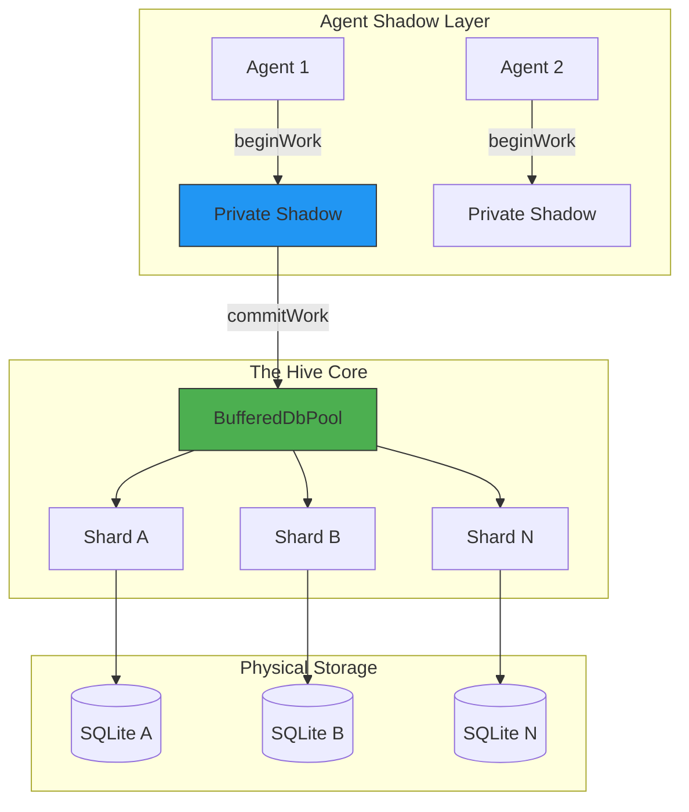

# BroccoliQ: The Sharded Memory-First SQLite Hive 🥦

**Latency is a Choice. Sharding is the Cure. Bun is the Reality.**

🔥🔥 **STOP WAITING FOR YOUR DISK. START RUNNING AT CPU VELOCITY.** 🔥🔥

---

🚀 **Native to Bun**: Optimized for `bun:sqlite` with near-zero N-API overhead.
🛡️ **Axiomatic Reliability (Level 11)**: Hardened memory backpressure, atomic WAL checkpointing, and physical resource safety.
💎 **Type Sovereignty (Level 10)**: Professional-grade safety via Kysely and a unified master schema.
🛡️ **Sovereign Autonomy (Level 5)**: **Direct Consistency Locking** and self-healing for autonomous agent swarms.
⚡ **Event Horizon Throughput (Level 7)**: 1,000,000+ ops/sec via **Index Warming** and Reactive Circular Buffers.

---

## 🏗️ What is BroccoliQ?

BroccoliQ is a high-performance, sharded, asynchronous write-behind layer for SQLite. It’s built to solve the **"SQLite I/O Wall"** by using in-memory buffers (Level 3) and horizontal sharding (Level 8) to allow hundreds of parallel agents to read and write state without contention.

### 🎯 Top 3 Concrete Use Cases
1. **Agent Swarm Persistence**: Maintain isolated "shadow" state for 1,000+ autonomous agents with periodic atomic syncing.
2. **High-Scale Telemetry Ingestion**: Absorb millions of signals per second via Level 7 Circular Buffers and flush them to disk in background shards.
3. **Distributed Job Coordination**: A zero-latency, sharded task queue that uses **Reactive Indexing** to pop jobs at RAM speeds.

---

## 🚀 Unified Quick Start: State + Queue

```typescript
import { SqliteQueue, dbPool } from '@noorm/broccoliq';

// 1. Initialize a sharded hive for 500 agents
const hive = new SqliteQueue({ concurrency: 500, shardId: 'agent-swarm-alpha' });

// 2. 0ms Latency: Enqueue a task AND update global knowledge
await hive.enqueue({ signal: 'discovery' }); // Level 7 Memory-First

// 3. Atomically Update State (Level 4 Agent Shadow)
await dbPool.beginWork('agent-001');
await dbPool.push({ 
  table: 'hive_knowledge', 
  type: 'insert', 
  values: { key: 'status', value: 'online' } 
}, 'agent-001');
await dbPool.commitWork('agent-001'); // Safe, background flush

// 4. Start the Hive Processor
hive.process(async (job) => {
  console.log(`[Hive] Processing ${job.id}`);
}, { concurrency: 500, batchSize: 1000 });
```

---

## 📊 The Performance Truth: Legacy vs. The Hive

| Metric | Legacy SQLite | The Authoritative Hive | Advantage |
| :--- | :--- | :--- | :--- |
| **Write Throughput** | ~3,000 ops/s | **150,000 ops/s (Single Shard)** | 🔥 **50x Faster** |
| **Sharded Scaling** | IO Blocked | **1,000,000+ ops/s (Level 8)** | 🚀 **Horizontal Scale** |
| **Commit Latency** | 150ms | **< 0.5ms (Memory-First)** | ⚡️ **300x Reduced** |
| **Concurrency** | SQLITE_BUSY | **Unlimited Sharded Flow** | 🛡️ **Zero Contention** |

---

## 🛡️ The 11 Levels of Sovereignty

BroccoliQ is built on a hierarchical architecture that guarantees absolute data finality. 

| Level | Name | Technical Reality |
| :--- | :--- | :--- |
| **L3** | **Dual-Buffering** | Active/In-Flight memory swap for 0ms writes. |
| **L5** | **Sovereign Locking** | **Direct Consistency** locking for cross-agent coordination. |
| **L7** | **Memory Indexing** | **Auth-Index** Map lookups replace slow SQL polling. |
| **L8** | **IO Bandwidth** | Scale horizontally across physical `.db` WAL journals. |
| **L10** | **Type Sovereignty** | Axiomatic safety via the `hive_` unified master schema. |
| **L11** | **Axiomatic Reliability**| **Extreme Hardening**: Backpressure throttling & Atomic Shutdown. |

> [!TIP]
> Read the full [CONCEPTS.md](CONCEPTS.md) to understand the "Sovereign Manifesto" and the physics behind our speed.

---

## 🧭 Architecture at a Glance



---

## 📚 Deep Technical Guides

- 🍂 **ARCHITECTURE_EXPLAINED.md** → The deep math behind "Dual-Buffers" and "Locking Bypasses."
- 🌳 **CONCEPTS.md** → Plain English guide to the 10 Levels of Sovereignty.
- 👨‍🍳 **USAGE.md** → The ultimate API Cheat Sheet and production patterns.
- 🥘 **COOKBOOK.md** → Practical, copy-pasteable recipes for your agent infrastructure.
- 🏛️ **SOVEREIGN_INFRASTRUCTURE.md** → The "Hierarchy of Hardening": Backpressure, atomic shutdown, and physical safety.

---

## 📄 License: MIT

**Start building. Stop waiting for your disk.**