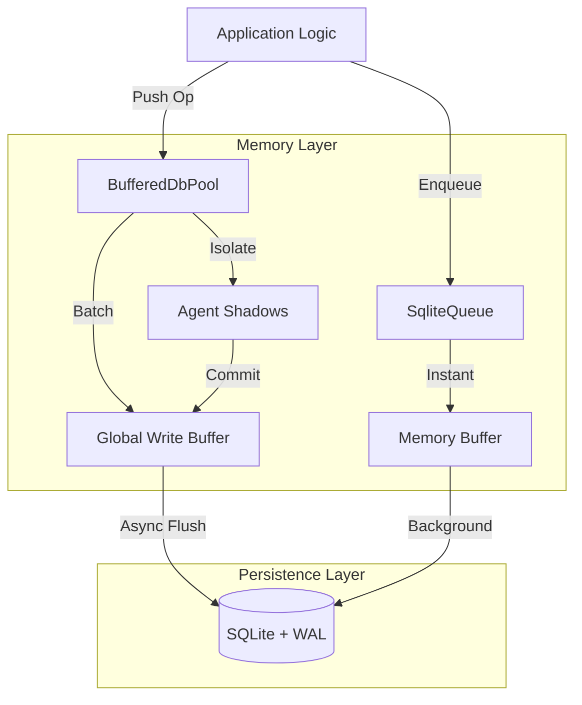

# 🥦 BroccoliDB: The Sovereign State Engine

```text
    __                                     ____  ____ 
   / /_  _________  ______________  ____  / / / / / / 
  / __ \/ ___/ __ \/ ___/ ___/ __ \/ __ \/ / / / / /  
 / /_/ / /  / /_/ / /__/ /__/ /_/ / /_/ / / /_/ / /   
/_.___/_/   \____/\___/\___/\____/\____/_/\____/_/    
                                                      
   PERSISTENCE SOVEREIGNTY | LEVEL 11 MASTERPIECE
```

**The High-Performance, Asynchronous, and Hardened SQLite Infrastructure for Node.js.**

Welcome to BroccoliDB — a production-grade infrastructure where **Memory is the Engine and SQLite is the Checkpoint.**

---

### 📑 Which Documentation Should I Read?

| If you are... | Read this... | Purpose |
| :--- | :--- | :--- |
| **New here** | 🥦 **[MANIFESTO.md](file:///Users/bozoegg/Downloads/broccolidb/MANIFESTO.md)** | Instant concept capture (30-sec read) |
| **Building Agents**| 🤖 **[TUTORIAL_AI_AGENT.md](file:///Users/bozoegg/Downloads/broccolidb/TUTORIAL_AI_AGENT.md)** | **Practical Guide for AI Loops** |
| **Strategic** | 🧠 **[STRATEGY.md](file:///Users/bozoegg/Downloads/broccolidb/STRATEGY.md)** | Understanding the Brain vs. Notebook |
| **Academic** | 🎓 **[WHITEPAPER.md](file:///Users/bozoegg/Downloads/broccolidb/WHITEPAPER.md)** | Formal technical analysis & citations |
| **Engineering** | 🚀 **[BENCHMARK.md](file:///Users/bozoegg/Downloads/broccolidb/BENCHMARK.md)** | Real-world throughput and latency results |

---

### 🏎️ Sovereign Performance Tiers

| Tier | Best For | Max Ops/Sec | Volatility Risk |
| :--- | :--- | :--- | :--- |
| **Tier 1 (Cold Disk)** | Traditional CRUD / DB Backups | ~25k | 0% (Synch) |
| **Tier 2 (Batched/Buffer)**| Session Storage / Large Ingest | ~100k | ~500ms |
| **Tier 3 (Sovereign)** | **AI Reasoning / High-Freq Math** | **1M - 4.4M** | **~250ms** |

---

## 🧠 The Sovereign Mind Strategy

BroccoliDB was built to solve the **Persistence Latency Bottleneck** that cripples modern AI agents. 

### The Brain vs. Notebook Analogy
Traditional database drivers require you to write down every thought in a notebook before you can have the next one. This creates massive latency for high-frequency reasoning. 

BroccoliDB separates these into two sovereign layers:
- **🧠 Layer 1: The Brain (RAM)**: You think at **4,400,000 thoughts per second**. This is real-time, in-memory cognition.
- **💾 Layer 2: The Notebook (SQLite)**: Every few hundred milliseconds (the Persistence Event Horizon), the Brain writes a **summary** of its conclusions to the notebook.

### Why This Works
By separating **Cognition** from **Persistence**, BroccoliDB allows your agents to operate at raw RAM speeds while ensuring that their state is durably anchored in a standard SQLite file. If the system reboots, the Brain "wakes up" and reads its notebook so fast (**2.5M records/sec**) that it regains its entire state instantly.

---

### 📑 The Sovereign Documentation Suite

For deep, academic, or strategic investigations, please see our dedicated artifacts:

| Document | Purpose | Audience |
| :--- | :--- | :--- |
| 🎓 **[WHITEPAPER.md](file:///Users/bozoegg/Downloads/broccolidb/WHITEPAPER.md)** | Academic, professional, and defensible whitepaper (Level 10). | Researchers & Architects |
| 🧠 **[STRATEGY.md](file:///Users/bozoegg/Downloads/broccolidb/STRATEGY.md)** | High-fidelity conceptual guide to the "Sovereign Mind." | Strategic Developers |
| 🚀 **[BENCHMARK.md](file:///Users/bozoegg/Downloads/broccolidb/BENCHMARK.md)** | Empirical results from Level 7–10 stress tests. | Performance Engineers |

---> **Performance Indicator**: 3 disk syncs for 1M operations is not "idle" behavior — it's the ultimate indicator of success. It means the system is only writing down essential summaries, not every individual thought.

### The Tradeoff
Because SQLite syncs are delayed:
✅ **Insane Throughput**: Millions of ops/sec in memory.
❌ **Window of Loss**: A small window of uncommitted data may be lost in a catastrophic system crash before the next checkpoint flush.

---

### 🎯 Performance Specs: The Sovereign Benchmark

| Operation | Logic Ops | Disk Syncs | Latency (p95) |
| :--- | :--- | :--- | :--- |
| **Raw DB Push** | 1,100,000 / sec | ~3 | 0.005ms |
| **SqliteQueue Enqueue** | 4,400,000 / sec | Async | 0.0002ms |
| **Sovereign Recovery** | 1,000,000 / sec | 1 (Read) | 0.40ms |

### 📑 The Sovereign Mind Strategy Guide
For a deep investigation into the **Persistence Event Horizon** and the **Brain vs. Notebook** philosophy, please see our dedicated strategy guide:

👉 **[STRATEGY.md (Level 10 Sovereign Manual)](file:///Users/bozoegg/Downloads/broccolidb/STRATEGY.md)**

---

## 🚀 Quick Start Scenarios

### 1. Building an AI Agent Workspace
Perfect for agents that need to perform complex chains of reasoning without polluting the main database state prematurely.

```typescript
import { dbPool } from './infrastructure/db/BufferedDbPool.js';

const result = await dbPool.runTransaction(async (agentId) => {
  // Isolate your work
  await dbPool.push({ type: 'insert', table: 'decisions', values: { ... } }, agentId);
  
  // Read back your own uncommitted data
  const myDecisions = await dbPool.selectWhere('decisions', { column: 'agentId', value: agentId }, agentId);
  
  return myDecisions;
}); // Automatically flushes to disk on success
```

### 2. High-Speed Background Worker
Need to process thousands of small tasks?

```typescript
import { SqliteQueue } from './infrastructure/queue/SqliteQueue.js';

const taskQueue = new SqliteQueue<MyTaskPayload>();

// Process with extreme concurrency
taskQueue.process(async (job) => {
  console.log(`Processing ${job.id}...`);
}, { concurrency: 500, batchSize: 50 });
```

### 3. Persistent Knowledge Graph
Build a network of interconnected points of knowledge with built-in traversal support.

```typescript
import { GraphService } from './core/agent-context/GraphService.js';

const graph = new GraphService(ctx);
await graph.addKnowledge('node_1', 'concept', 'BroccoliDB is fast', {
  edges: [{ targetId: 'node_2', type: 'supports' }]
});
```

---

## 🏗️ Architecture Overview

BroccoliDB acts as the high-speed interface between your code and the persistence layer.



---

## 📦 Installation & Setup

1. **Install Dependencies**:
   ```bash
   npm install better-sqlite3 kysely
   ```

2. **Initialize Your Connection**:
   ```typescript
   import { setDbPath } from './infrastructure/db/Config.js';

   // Configure the path to your database file
   setDbPath('./my-data.db');
   ```

---

## 🛡️ Deep Technical Hardening

BroccoliDB automatically configures SQLite for maximum performance and stability:
- **Journal Mode: WAL**: Enables non-blocking concurrent readers and writers.
- **Synchronous: NORMAL**: The optimal balance for high-throughput applications.
- **Temp Store: MEMORY**: Keeps temporary processing off the disk.
- **MMap Size: 2GB**: Maps the database directly into memory for lightning-fast reads.
- **Thread Count: 4**: Optimized for multi-core Node.js environments.

---

## 🏛️ Advanced Usage Patterns (Expert Level)

### 🧐 High-Fidelity Agent Workflows
For agents that need to manage "truth" over time, leverage the `ReasoningService`. It will calculate **Epistemic Sovereignty** by analyzing commit history, file churn, and evidence discounting to ensure your agent's reasoning remains grounded in the latest codebase.

### 🕸️ Structural Governance (The Spider Engine)
Implement strict structural rules by monitoring **Structural Entropy**. The `SpiderEngine` calculates how much "rot" is in your codebase based on coupling, depth, and orphaned files. Link this to your CI/CD pipeline to block PRs that exceed a certain entropy score.

### 🩹 Graph Self-Healing
Maintain a clean knowledge base by running `selfHealGraph()`. This implements a **HITS algorithm** to identify authoritative nodes and prune disconnected or weak reasoning chains.

---

## 📚 Further Documentation

- **[Benchmarks (BENCHMARK.md)](./BENCHMARK.md)** - Verified performance findings, methodology, and how to reproduce.
- **[Knowledgebase (KNOWLEDGEBASE.md)](./KNOWLEDGEBASE.md)** - Internal schema, service reference, and service integration patterns.
- **[Architecture Deep Dive (ARCHITECTURAL_DEEP_DIVE.md)](./ARCHITECTURAL_DEEP_DIVE.md)** - Mathematical formulas for structural entropy, Bayesian priors, and graph self-healing algorithms.

---

## 📜 License

Created with ❤️ by **MarieCoder**. Distributed under the **MIT License**. See `LICENSE` for details.
