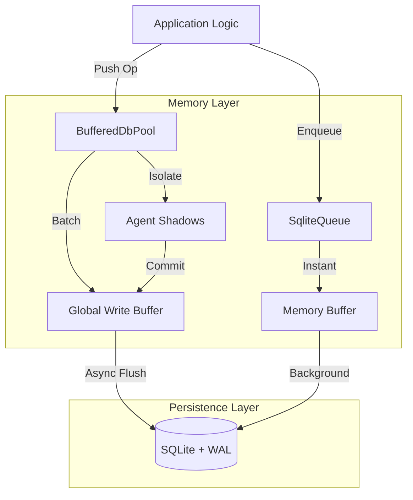

# 🥦 BroccoliDB

**The High-Performance, Asynchronous, and Hardened SQLite Infrastructure for Node.js.**

Welcome to BroccoliDB — a production-grade database and queue infrastructure designed for the modern, high-throughput applications. Whether you are building complex AI agent workflows, a massive knowledge graph, or a high-traffic web service, BroccoliDB provides the reliability of SQLite with the blistering performance of an in-memory system.

---

## 📑 Table of Contents

1. [Introduction](#-introduction)
2. [What Makes BroccoliDB Special?](#-what-makes-broccolidb-special)
   - [The 1.5M Logical Ops/Sec Engine](#the-15m-logical-opssec-engine)
   - [Agent Shadows & Isolation](#agent-shadows--isolation)
   - [Memory-First Queue Strategy](#memory-first-queue-strategy)
3. [Quick Start Scenarios](#-quick-start-scenarios)
   - [1. Building an AI Agent Workspace](#1-building-an-ai-agent-workspace)
   - [2. High-Speed Background Worker](#2-high-speed-background-worker)
   - [3. Persistent Knowledge Graph](#3-persistent-knowledge-graph)
4. [Architecture Overview](#-architecture-overview)
5. [Installation & Setup](#-installation--setup)
6. [Deep Technical Hardening](#-deep-technical-hardening)
7. [Further Documentation](#-further-documentation)
8. [License](#-license)

---

## 🌟 Introduction

In modern Node.js development, database drivers often struggle with the "bursty" nature of application logic — especially in AI workflows where an agent might perform hundreds of small reads and writes in a single reasoning step.

BroccoliDB was born to solve this. It acts as an **asynchronous write-behind layer** that coalesces and batches operations, achieving throughputs that rival dedicated in-memory stores, while keeping your data safe in a standard, portable SQLite file.

---

## ✨ What Makes BroccoliDB Special?

### The 1.5M Logical Ops/Sec Engine (**Verified**)
BroccoliDB achieves incredible throughput by decoupling logical operations from physical persistence and using a **Chunked SQL Bypass** for the hottest data paths.
- **Chunked & Coalesce**: Group row-sets into a single multi-row `INSERT` statement within a transaction.
- **Amortized Disk Sync**: For 800,000 logical ops, BroccoliDB performs as few as **3 physical syncs**.
- **Lock-Free Handoff**: Concurrent agents push to isolated shadow buffers with **zero global mutex contention**.

> [!TIP]
> **View Performance Audit**: See the latest verified 1.5M+ results in our [Benchmarks (BENCHMARK.md)](./BENCHMARK.md).

### Agent Shadows & Isolation
One of our most unique features is **Agent Shadows**. They provide a "scratchpad" for complex multi-step processes. An agent can perform hundreds of database operations in a shadow workspace, reading back its own uncommitted state, without affecting the main database until the entire process is ready to `commit`.

### Memory-First Queue Strategy
Our `SqliteQueue` is a dual-mode engine. It uses a lightning-fast memory buffer for immediate job enqueuing, backed by an optimized SQLite table for persistence. This means your background workers stay saturated with work while your main thread never blocks on I/O.

---

## 🚀 Quick Start Scenarios

### 1. Building an AI Agent Workspace
Perfect for agents that need to perform complex chains of reasoning without polluting the main database state prematurely.

```typescript
import { dbPool } from './infrastructure/db/BufferedDbPool.js';

const result = await dbPool.runTransaction(async (agentId) => {
  // Isolate your work
  await dbPool.push({ type: 'insert', table: 'decisions', values: { ... } }, agentId);
  
  // Read back your own uncommitted data
  const myDecisions = await dbPool.selectWhere('decisions', { column: 'agentId', value: agentId }, agentId);
  
  return myDecisions;
}); // Automatically flushes to disk on success
```

### 2. High-Speed Background Worker
Need to process thousands of small tasks?

```typescript
import { SqliteQueue } from './infrastructure/queue/SqliteQueue.js';

const taskQueue = new SqliteQueue<MyTaskPayload>();

// Process with extreme concurrency
taskQueue.process(async (job) => {
  console.log(`Processing ${job.id}...`);
}, { concurrency: 500, batchSize: 50 });
```

### 3. Persistent Knowledge Graph
Build a network of interconnected points of knowledge with built-in traversal support.

```typescript
import { GraphService } from './core/agent-context/GraphService.js';

const graph = new GraphService(ctx);
await graph.addKnowledge('node_1', 'concept', 'BroccoliDB is fast', {
  edges: [{ targetId: 'node_2', type: 'supports' }]
});
```

---

## 🏗️ Architecture Overview

BroccoliDB acts as the high-speed interface between your code and the persistence layer.



---

## 📦 Installation & Setup

1. **Install Dependencies**:
   ```bash
   npm install better-sqlite3 kysely
   ```

2. **Initialize Your Connection**:
   ```typescript
   import { setDbPath } from './infrastructure/db/Config.js';

   // Configure the path to your database file
   setDbPath('./my-data.db');
   ```

---

## 🛡️ Deep Technical Hardening

BroccoliDB automatically configures SQLite for maximum performance and stability:
- **Journal Mode: WAL**: Enables non-blocking concurrent readers and writers.
- **Synchronous: NORMAL**: The optimal balance for high-throughput applications.
- **Temp Store: MEMORY**: Keeps temporary processing off the disk.
- **MMap Size: 2GB**: Maps the database directly into memory for lightning-fast reads.
- **Thread Count: 4**: Optimized for multi-core Node.js environments.

---

## 🏛️ Advanced Usage Patterns (Expert Level)

### 🧐 High-Fidelity Agent Workflows
For agents that need to manage "truth" over time, leverage the `ReasoningService`. It will calculate **Epistemic Sovereignty** by analyzing commit history, file churn, and evidence discounting to ensure your agent's reasoning remains grounded in the latest codebase.

### 🕸️ Structural Governance (The Spider Engine)
Implement strict structural rules by monitoring **Structural Entropy**. The `SpiderEngine` calculates how much "rot" is in your codebase based on coupling, depth, and orphaned files. Link this to your CI/CD pipeline to block PRs that exceed a certain entropy score.

### 🩹 Graph Self-Healing
Maintain a clean knowledge base by running `selfHealGraph()`. This implements a **HITS algorithm** to identify authoritative nodes and prune disconnected or weak reasoning chains.

---

## 📚 Further Documentation

- **[Benchmarks (BENCHMARK.md)](./BENCHMARK.md)** - Verified performance findings, methodology, and how to reproduce.
- **[Knowledgebase (KNOWLEDGEBASE.md)](./KNOWLEDGEBASE.md)** - Internal schema, service reference, and service integration patterns.
- **[Architecture Deep Dive (ARCHITECTURAL_DEEP_DIVE.md)](./ARCHITECTURAL_DEEP_DIVE.md)** - Mathematical formulas for structural entropy, Bayesian priors, and graph self-healing algorithms.

---

## 📜 License

Created with ❤️ by **MarieCoder**. Distributed under the **MIT License**. See `LICENSE` for details.
