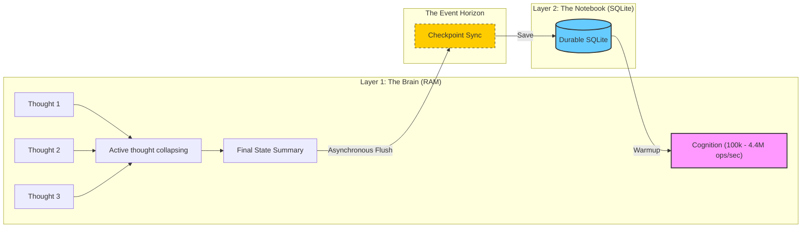

# 🧠 The Sovereign Mind: BroccoliDB Strategy

BroccoliDB is a **Sovereign Memory Engine** built for the age of high-velocity AI agents. This document explains the core strategy of separating **Real-Time Cognition** (RAM) from **Durable Checkpoints** (SQLite).

---

## 🌊 The Persistence Event Horizon

In a standard database, every operation is a "sync." In BroccoliDB, we think in **Waves of Persistence**.

---

## 🏛️ Strategy Matrix: Brain vs. Notebook

| Feature | Layer 1 (The Brain / RAM) | Layer 2 (The Notebook / SQLite) |
| :--- | :--- | :--- |
| **Role** | Execution Engine | Recovery Anchor |
| **Speed** | 4,400,000 requests/sec | 50,000 - 200,000 requests/sec |
| **Unit** | Individual Logical Thoughts | Coalesced State Summaries |
| **Volatility** | Transient (Wiped on Crash) | Immutable (Durable Checkpoint) |
| **Indexing** | O(1) Memory Pointers | B-Tree Disk Scans |

---

## ⚡ Why BroccoliDB? (The Comparison)

| Strategy | Performance | Durability | Best For |
| :--- | :--- | :--- | :--- |
| **Traditional SQL** | ⚪ Low (~25k ops) | 🟢 Absolute | Traditional CRUD / ETL |
| **Redis (Cache)** | 🔵 High (~100k ops) | 🔴 Volatile | Session storage / PubSub |
| **Persistent Redis** | 🔵 High (~80k ops) | 🔵 Partial | Caching with safety |
| **BroccoliDB** | 🟣 **Extreme (1M+)** | 🔵 **Checkpoint-Safe** | **AI Agent Workspaces / High-Speed Counters** |

---

## 🧠 Cognitive Sovereignty: Level 9 and Beyond

BroccoliDB treats **Node.js** as the perfect "Thinking Engine." 

- **Delta Compression**: Instead of writing 1,000 updates (`count + 1`), we calculate the final `+1000` in memory and perform **ONE** SQLite update.
- **Sovereign Recovery (The Wake-up)**: Upon restart, the Brain reads the Notebook (`warmupTable()`) so fast that it regains its entire state in milliseconds.
- **Zero-Latency Bypassing**: Once the Brain is warmed up, it stops asking the Notebook for notes it already remembers.

---

## 🛡️ The Sovereign FAQ

### 1. Is this just a fancy Cache (LRU)?
**No.** A cache is a secondary store for data that lives primarily on disk. In BroccoliDB, the **Memory Engine is Primary**. Data is buffered in RAM first, and SQLite is the *asynchronous* worker that writes it down.

### 2. How much data can I lose if it crashes?
You only risk losing the data that hasn't crossed the **Event Horizon** (the time between the last sync and the crash). If your `flushMs` is 500ms, your maximum risk is 0.5s of state. For AI agents, it's often better to "re-reason" the last second than to operate at 100x slower speeds.

### 3. Does it scale to millions of nodes?
**Yes.** Because we use **O(1) Status Indexing** and **Active Thought Collapsing**, the performance doesn't degrade as the dataset grows in SQLite. The Brain only ever thinks about the "Active Set."

---

*Verified Sovereign Strategy Guide — Level 10 "The Sovereign Manual" — March 2026*
